# RackTrack User Guide — Phone edition

Point your phone at a rack. RackTrack maps every unit, device, switch and port — then checks it against your records.

*Screenshots taken on an iPhone or Android phone. Every screenshot was captured from the running application.*

## What do you want to do?

**Getting in**

1. [Create an organization](#create-org)
2. [Join a team you were invited to](#invite)
3. [Sign in](#signin)
4. [Reset a forgotten password](#forgot)
5. [You are stuck on “Waiting for approval”](#pending)

**Scanning a rack**

6. [Find your way around](#nav)
7. [Take a photo the app can read](#good-photo)
8. [Scan a rack](#scan-single)
9. [Scan a rack too tall for one photo](#scan-tall)
10. [Scan a whole row of racks](#scan-row)
11. [The app rejected your photo](#rejected)

**Using your results**

12. [Read the rack overview](#overview)
13. [Find a specific port](#find-port)
14. [Correct the app when it is wrong](#correct)
15. [Share a result, or open the switch console](#share)
16. [Register the rack in your CMDB](#cmdb)

**Going deeper on the equipment**

17. [See what is plugged in right now](#ports)
18. [See what is on the end of each cable](#cables)
19. [Check whether something is reachable](#trace)
20. [Check a switch's firmware and security](#firmware-switch)
21. [Choose the right SFP module](#sfp)
22. [See the rack as a diagram](#topology)
23. [See what the network says about the rack](#network)
24. [Find out what changed, and when](#drift)

**Looking things up**

25. [Look up a datasheet](#specs)
26. [Check any firmware version](#firmware-tool)

**Your account**

27. [Reopen a scan you did earlier](#history)

**For administrators**

28. [Connect your CMDB](#connect)
29. [Add people to your team](#people)
30. [Approve a new organization](#approve)
31. [Sell surplus gear](#marketplace)

**Reference**

- [Where each screen gets its data](#data-sources)
- [Troubleshooting — find your symptom](#troubleshooting)
- [Glossary](#glossary)
- [Limits and timings](#limits)

---

## Getting in

### 1. Create an organization
*New company on RackTrack*

Use this if your company is new to RackTrack. You become its administrator.

1. On the welcome screen, tap **Get Started**.
2. Fill in your **Email**, a **Username**, your **Organization** name, and a **Password** (twice).
3. Watch the meter under the password. It names the one thing still missing — “Need a digit”. When it reads “✓ Strong password” and the second box reads “✓ matches”, **Continue** switches on.
4. Tap **Continue**. RackTrack emails you a six-digit code.
5. Type the code into the six boxes and tap **Verify**.
6. You land on the **Waiting for approval** screen — see the next task.

> **IMPORTANT** — The code dies after **one minute**. Have your inbox open before you tap **Continue**. If it runs out, tap **Resend**.

> **TIP** — Your password needs all five: **8 characters**, an **uppercase**, a **lowercase**, a **digit**, and a **special character**.

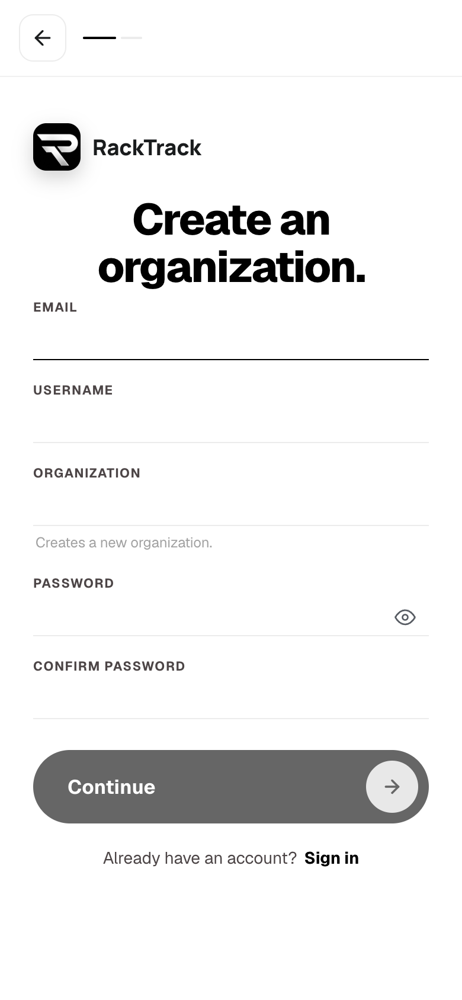
*The password meter must read “Strong password” before **Continue** turns on.*

### 2. Join a team you were invited to
*You got an invitation link*

An administrator sends you a link. You do not create an organization — you join theirs.

1. Open the link. It shows what you are joining, e.g. “Join Acme · London as Member”.
2. Your email is filled in and locked — the invitation was issued to that address.
3. Pick a **username**, create a **password**, tap **Join**.
4. You are signed in and taken straight to the scan screen.

> **IMPORTANT** — A link works **once** and expires after **seven days**. If yours has run out, ask for a new one — the old one cannot be reused.

> **NOTE** — RackTrack does not email invitations. Your administrator sends the link to you themselves, so it may arrive by chat or email.

### 3. Sign in
*Everyone*

1. Enter your **Username or email** and your **Password**.
2. Leave **Organization** empty unless your username exists in more than one organization.
3. Tap **Sign in**.

| Where you land | Who |
|---|---|
| The Organizations console | Administrators and the platform owner |
| The scan screen | Everyone else |

> **TIP** — You stay signed in for **30 days**, and losing signal will not sign you out — RackTrack keeps working where the datacenter has no reception.

> **NOTE** — If you see the word `rate_limited`, you have tried more than 10 times in a minute. Wait 60 seconds.

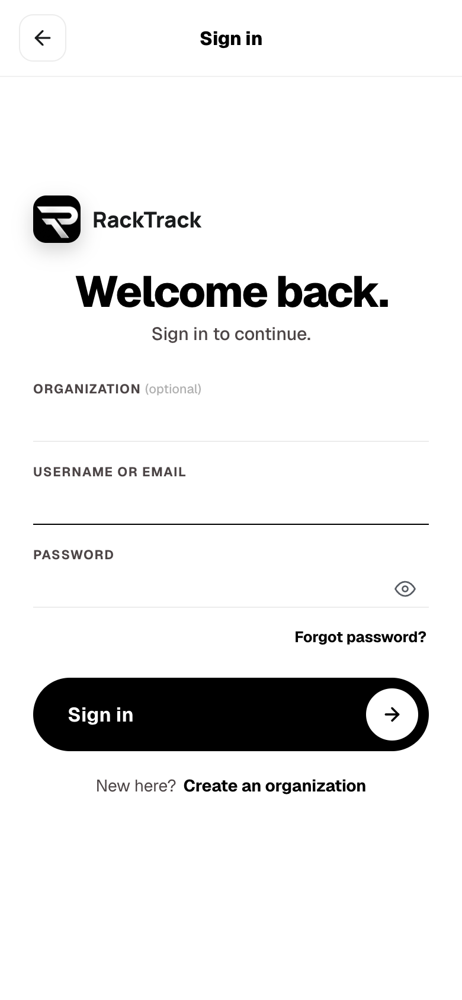
*The **Organization** box is optional — most people leave it empty.*

### 4. Reset a forgotten password
*Everyone*

1. On the sign-in screen tap **Forgot password?** and enter your email.
2. Enter the six-digit code RackTrack emails you, then tap **Verify code**.
3. Choose **Yes, change password** to set a new one — or **No, take me to the app** to just get in, leaving your old password untouched.

> **TIP** — **No, take me to the app** is the fast route when you have simply mistyped your password three times.

> **IMPORTANT** — The code expires **one minute** after it was sent — including while you sit on the “Code verified” screen. Do not pause there.

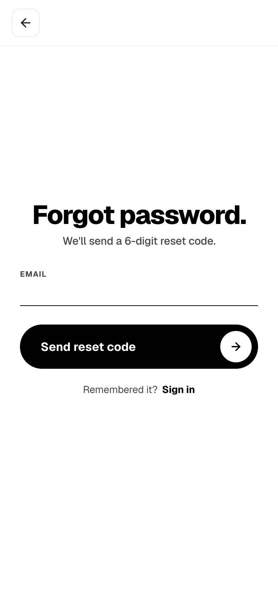
*RackTrack always says a code is on its way — check your spelling.*

### 5. You are stuck on “Waiting for approval”
*New organizations*

A brand-new organization has to be approved by the platform owner before anyone can scan. The screen checks by itself every few seconds and lets you in the moment you are approved.

| What it says | What it means | What to do |
|---|---|---|
| **Waiting for approval** | Nobody has looked at your request yet. | Wait — the screen lets you in on its own. |
| **Request not approved** | The platform owner declined it. | Contact them. Nothing in the app will change this. |
| **Organization deactivated** | Your organization was switched off. | Contact the platform owner. It returns on its own if they switch it back on. |

> **IMPORTANT** — **Nobody is emailed when you sign up.** The platform owner only finds out by opening their console. If you are waiting, tell them directly.

---

## Scanning a rack

### 6. Find your way around
*Everyone*

Three tabs sit along the bottom of every screen: **HOME**, **SCAN** and **PROFILE**.

> **IMPORTANT** — **The middle **SCAN** tab is also the camera shutter.** There is no separate shutter button. This is the single thing new users hunt for and cannot find.

> **NOTE** — The rack links disappear when you refresh, and are cleared on purpose when you start a new scan. To reopen an old rack, use **Profile → Recent Scans**.

Once you open a rack, six more links appear for that rack: **Overview**, **Ports**, **Topology**, **Network**, **Switches** and **Drift**. On a phone they sit in a strip across the top of the result, with **Network** and **Drift** behind the **More** button.

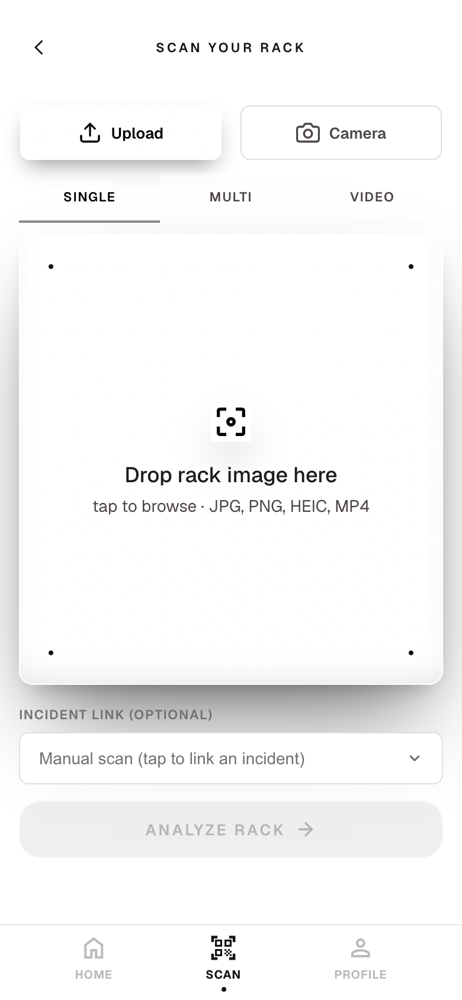
*The scan screen. Three tabs sit along the bottom at all times.*

### 7. Take a photo the app can read
*Everyone*

Photo quality decides result quality. In camera mode a guide box sits over the picture and one line of text tells you the single thing to fix.

| If it says | Do this |
|---|---|
| “Move closer so the rack fills the frame” | Step forward until the rack fills the box. |
| “Move to better lighting” | Move, or change your angle away from the light behind the rack. |
| “Hold steady — keep still for focus” | Brace your elbows and wait a beat. |
| “Looks great — tap the shutter below” | Take the photo. |

> **IMPORTANT** — **The shutter will not fire until all three checks pass.** If tapping **SCAN** seems to do nothing, read the hint line — the app is telling you what is wrong.

**Rules of thumb:** stand square to the rack, not off to one side. Hold the camera level with the middle of the rack. Get the whole rack in frame, top rail to bottom rail. If cables cover the front, take extra photos from the left and right so the app can see behind the bundles.

### 8. Scan a rack
*Everyone · the main job*

1. Open **SCAN**.
2. Choose **Camera** to take a photo now, or **Upload** → **SINGLE** to use one you already have.
3. If using the camera: line the rack up until the hint reads “Looks great”, then tap the middle **SCAN** tab to fire the shutter.
4. Tap **Analyze Rack**.
5. Wait. You land on the rack's **Overview**.

> **NOTE** — The progress bar is an estimate, not a measurement. It climbs to about 88% and waits there until the real work finishes. Sitting at 88% for a few seconds is normal, not stuck.

> **TIP** — Photographing the **same rack twice costs nothing** — RackTrack recognises the identical photo and hands back the earlier result instantly, with your corrections still applied.

***Upload** takes a photo you already have; **Camera** takes one now.*

### 9. Scan a rack too tall for one photo
*Everyone*

1. Open **SCAN** → **Upload** → **MULTI**.
2. Tap **Select photos** and add **2 to 8** overlapping photos of the rack.
3. Tap **Stitch & Analyze**.

> **TIP** — Aim for **20–40% overlap** between neighbouring photos — enough shared detail for the app to join them. You do **not** need to shoot them in order.

> **NOTE** — This is for one **tall** rack. To capture a whole **row** of separate racks, use a video — see the next task.

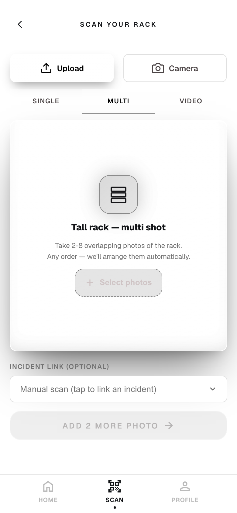
***MULTI** mode. Order does not matter — RackTrack works it out.*

### 10. Scan a whole row of racks
*Everyone*

Record one video panning across the row. RackTrack finds each rack in the footage, picks the best frame for each, and analyses them one by one — each gets its own result.

1. Open **SCAN** → **Upload** → **VIDEO**.
2. Upload a steady pan across the row — between **1 and 120 seconds**.
3. Tap **Analyze Rack**.
4. You land on the first rack. A **rack strip** now runs across the top — one button per rack.

> **IMPORTANT** — Linking an incident **turns multi-rack off** — a ticket is about one rack, so only that one is analysed.

Tap any rack in the strip to jump to it; RackTrack keeps you on the same sub-page as you move. **Combined 3D** draws **every rack in the row in one scene**.

### 11. The app rejected your photo
*Everyone*

When a photo is too small, blurry, tilted or buried in cables, RackTrack stops and offers **Retake** and **Proceed anyway**.

| Message | What to do |
|---|---|
| “Please take the photo from the front of the rack…” | You are side-on or it is too dark. Stand square and retake. |
| “Please upload a clearer photo of the rack…” | Fewer than three rack units were readable. Get the whole rack in frame. |
| “The image appears tilted…” | Hold the phone straight and retake. |
| “This rack is heavily covered by cables…” | Add photos from the left and right of the rack. |
| “Camera access denied…” | Allow camera permission, or use **Upload**. |

> **IMPORTANT** — **Proceed anyway** switches the safety checks **off** and analyses the photo regardless. A genuinely bad photo then comes back with devices missing — or an empty rack. **Retake** is nearly always the faster route to a correct answer.

---

## Using your results

### 12. Read the rack overview
*Everyone*

Every scan lands here. Your photo comes back with a coloured box around each device, each with its name.

1. **Tap a box** to select that device.
2. **Tap it again** to zoom into it and hide everything else. **Back to rack** returns you.
3. Pinch, scroll, or use the zoom buttons to get closer. Drag to move around once zoomed in.

> **NOTE** — Empty units, closed panels and anything the app could not identify are deliberately left unboxed, so the picture stays readable.

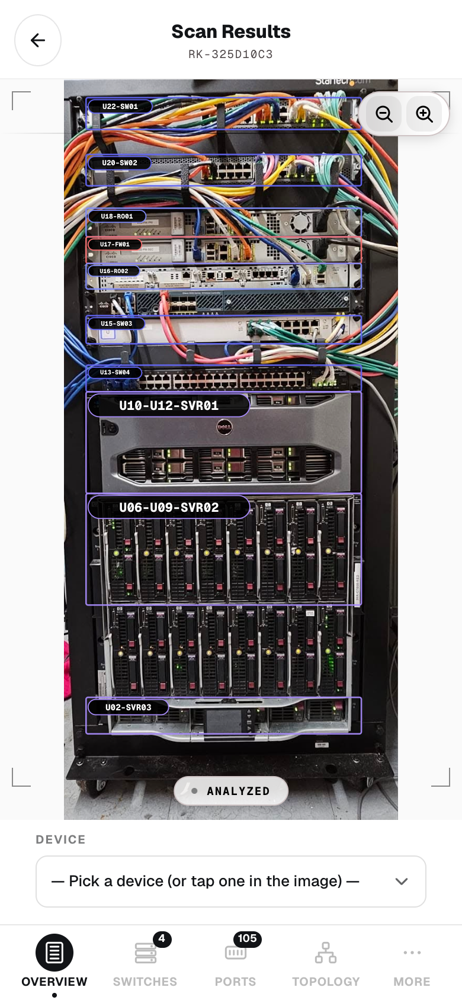
*Your own photo, with every device the app found boxed and named.*

### 13. Find a specific port
*Everyone · the job you came for*

You have a port number and you need to put your hand on it.

1. Choose the device from the **Device** list — or just tap it in the photo.
2. Pick the port type: **RJ45**, **SFP**, **Console** or **USB**. Only the types that device actually has are offered, each showing its count.
3. Type the port number.
4. Tap **Find Port**.

| Reading | What it means |
|---|---|
| **Status** | **Connected** (a cable is in it), **Empty**, or **Unknown**. |
| **Cable** / **Color** | The connector type and the cable's colour — useful when tracing a run by eye. |
| **Linked endpoint** | What is on the **other end**, asked of the switch itself. Marked **LIVE** because it is read from the network, not the photo. |

> **NOTE** — If the app is unsure it says so: *“Not fully sure about this cable (42% confidence)…”*. Trust your eyes over the app when it hedges — then correct it (next task).

RackTrack zooms your photo to that exact port and dims everything else. Tap the picture to cycle between the whole rack, the device, and the close-up.

*Pick the device, pick the port type, type the number.*

### 14. Correct the app when it is wrong
*Everyone*

RackTrack asks you to check its work with plain questions like **“Port 7 on Switch. Right?”** and **Yes** / **No** buttons. Answering **No** fixes your result immediately.

| The question | Answer **No** when… | What happens |
|---|---|---|
| **Port N on <device>. Right?** | The highlight landed on the wrong port. | Type the real port. The app re-numbers the device and moves the highlight. |
| **Cable color is <colour>. Right?** | The colour is wrong. | Pick the real colour from twelve swatches. |
| **Detected as <type>. Right?** | It called a firewall a switch. | Choose the real device type. |
| **Detected N ports. Right?** | The port count is off. | Type the real number. The app re-counts and redraws. |

> **TIP** — Worth the ten seconds. It fixes **your** result now, and it is fed back into training so the model gets better at your equipment.

> **NOTE** — Correcting a port number does not change the number you asked for. Say “port 7 is really port 5”, and RackTrack learns the offset then shows you where **port 7** truly lives.

### 15. Share a result, or open the switch console
*Everyone*

| Button | What it does |
|---|---|
| **View** | Opens the full scan report without leaving the page. |
| **Report** | Opens the report in a new tab, ready to save or print. |
| **Share** | Sends it by **Teams**, **Outlook** or **Slack**. Your address is remembered. |
| **Console** | Opens an SSH session to the switch, focused on this port. |
| **Find** | Locates another port on the same device. |
| **New Scan** | Starts a fresh scan. |

The **Console** gives you a **menu of questions** rather than asking you to remember command syntax — pick one and it runs. Tap **Done** and RackTrack assembles a **Port Report** with a plain-English verdict, such as *“Link is DOWN — no device connected (or cable unplugged at the far end).”*

### 16. Register the rack in your CMDB
*Needs a connected CMDB*

If your organization has connected a configuration database, RackTrack checks each scan against it. When it finds a rack your records have never heard of, it offers to file the paperwork.

1. A message appears after the scan: **“Rack not registered in CMDB”**. Tap **Raise Ticket**.
2. RackTrack opens a request describing everything it found, and shows you the reference number.
3. Tap **Approve** to register the equipment.
4. **Successfully registered** appears, listing every device, port and cable written to your records.

> **NOTE** — The offer appears **once**, on a fresh scan, and only for about half a minute. Tap **Not now** and it will not nag you again — but the rack stays unregistered.

> **IMPORTANT** — Without a connected CMDB, RackTrack simply never offers this. Your scan is unaffected.

---

## Going deeper on the equipment

### 17. See what is plugged in right now
*Needs switch access*

Every other screen is built from your photo. **This one is not.** It signs in to the switch over the network and asks it directly what is plugged in, what is talking, and what is free.

| Tile | Meaning |
|---|---|
| **In use** | Ports with a live link, out of the total. |
| **Available** | Ports you can plug into today. |
| **Identified** | Ports where the far-end device announced itself. |

> **IMPORTANT** — A port with a **description on the switch but nothing plugged in** reads as **Reserved**, not **Available**. Somebody labelled it for a reason — check before you take it.

> **NOTE** — This screen can fail even when your scan was perfect — if the switch is unreachable, or its sign-in details are not saved. That is a network problem, not a scanning problem.

The **faceplate** is a map of the physical front of the switch, so a port on screen sits where it sits on the metal. Green is up, amber is an uplink carrying many devices, grey is free. The filter pills — **All**, **In Use**, **Available**, **Linked**, **Errors** — narrow the list below.

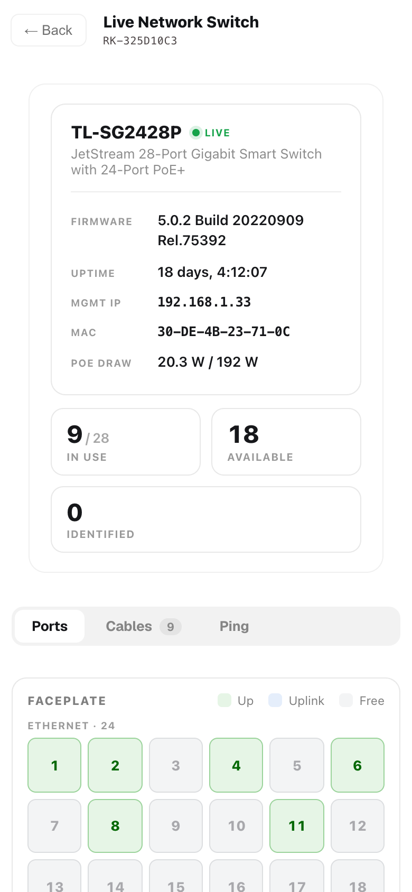
*The faceplate mirrors the physical front of the switch.*

### 18. See what is on the end of each cable
*Needs switch access*

1. Open **Ports** and choose the **Cables** tab.
2. Click any row to expand it into a trace showing both ends.
3. Where a port feeds a whole downstream network, the trace lists every device behind it, resolved to the manufacturer that made each one.

> **IMPORTANT** — RackTrack can only see what the switch can see. **A patch panel or wall socket in the middle of a run has no electronics**, so it is invisible here — the cable appears to run straight from the switch to the far end. That is physics, not a gap in the app.

*Every live cable, listed as *this port → that device*.*

### 19. Check whether something is reachable
*Needs switch access*

Runs the test **from the switch**, not from your laptop — so it tests the path your equipment actually takes, not the path your phone takes over the office Wi-Fi.

1. Open **Ports** → **Trace**.
2. Type an IP address or a hostname.
3. Tap **Ping** to ask “can you reach it?”, or **Traceroute** to see every router on the way and which one is slow.

> **TIP** — The two shortcut chips save typing: `8.8.8.8` tests the whole path out to the internet, and the **gateway** chip tests just the first hop. If the gateway answers and `8.8.8.8` does not, the problem is upstream of your rack.

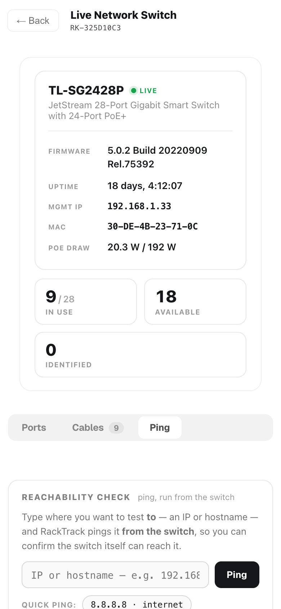
*Ping and traceroute, run from the switch itself.*

### 20. Check a switch's firmware and security
*Everyone*

1. Open the rack → **Switches** and pick the switch's tab.
2. If the card says **Not detected**, tap **Enter make / model** and type them in — the lookups need both.
3. Open the **Firmware** tab. If no version is recorded, tap **Enter version** and type it.
4. Read the status pill and the **CVEs** tile.

| Reading | What it means |
|---|---|
| **Latest** | The newest version RackTrack could **verify** from the vendor. |
| **CVEs** | Publicly known security holes. `5 (1c/2h)` = five in total, one critical, two high. |
| **Min safe** | The oldest version still considered acceptable. Upgrade at least this far. |

> **IMPORTANT** — **“Latest version unknown” does not mean you are up to date.** It means RackTrack could not confirm the newest version. Follow the **Check site ↗** link and look yourself.

> **NOTE** — CVEs are matched by **vendor and product**, not proven against your exact version. Treat the list as “worth reading”, not “definitely affects me” — and an empty list is not proof of safety.

> **IMPORTANT** — What you type here is saved **in this browser only**. It does not reach the server, your CMDB or your colleagues, and it is lost if you clear your browsing data.

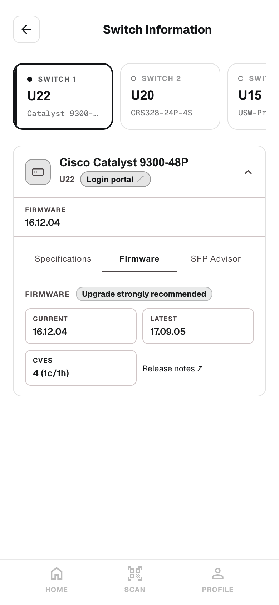
*Current version, newest version, and the known security issues.*

### 21. Choose the right SFP module
*Everyone*

Given the switch's empty SFP slots, this recommends transceivers that fit — with a **★ TOP PICK**, the price, and a link to buy.

> **IMPORTANT** — Check the recommendation against your switch's own compatibility list before you buy. When RackTrack cannot get a definitive answer for your model it falls back to a **general catalogue**, which may not be the right brand for your switch.

It also suggests **direct-attach cables**, which replace the transceiver-and-fibre pair entirely for short runs inside a rack, and are usually cheaper.

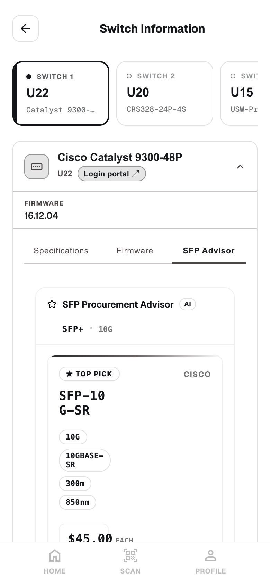
*A top pick, alternatives, and direct-attach cables.*

### 22. See the rack as a diagram
*Everyone*

**2D** draws the rack as an elevation — a numbered column of U slots, matching the drawing on the cabinet door. **3D** puts the same rack in space; drag to orbit, scroll to zoom.

1. Click any device. The panel below fills in.
2. **Peer chips** show its neighbours — `2×` means two cables run to that neighbour.
3. The **Ports** table lists every port, whether it is connected, which cable is in it, and what is on the other end.

| Colour | Meaning |
|---|---|
| Green | A connected RJ45 (copper) port. |
| Cyan | An SFP (fibre) port. |
| Amber | An uplink — traffic leaving this rack. |
| Grey | Free. |

> **NOTE** — The drawing is built in the background after a scan, so it can lag by a few seconds. If you see **“Topology is being prepared”**, wait a moment and tap **Retry**.

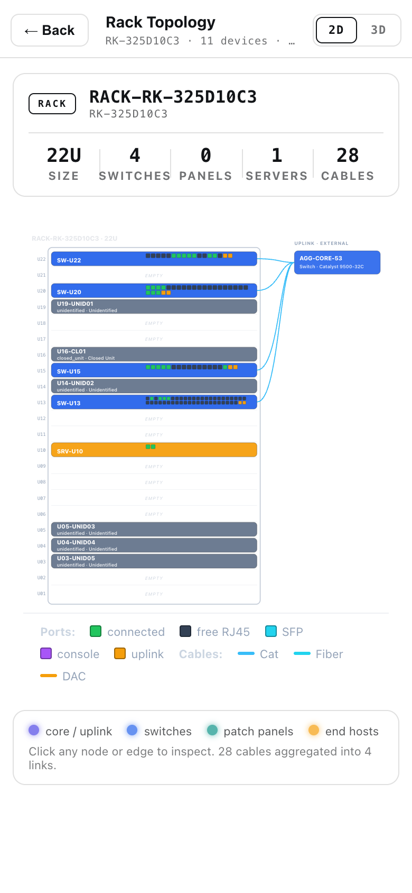
*Every device drawn where it physically sits, with its cables.*

### 23. See what the network says about the rack
*Needs Netdisco*

The scan tells you what is *physically* in the rack. This tells you what is *electrically alive*: which ports are genuinely up right now, which VLAN each is on, and how many devices talk through each.

1. Open the rack → **Network**.
2. Check the pill at the top right reads **Network View online**.
3. Click a device that shows an IP. Devices marked *not in Network View* cannot be opened — the network has no record of them.
4. Filter its ports with **Live**, **Up**, **Down** or **All**.

> **NOTE** — **Patch panels never appear here.** A passive panel has no electronics and cannot announce itself to the network. Its absence is expected, not a fault.

> **IMPORTANT** — Needs a **Netdisco** server, set up by an administrator. Without one this page shows *“Network view is being prepared”* permanently — that means “not configured”, not “try again shortly”.

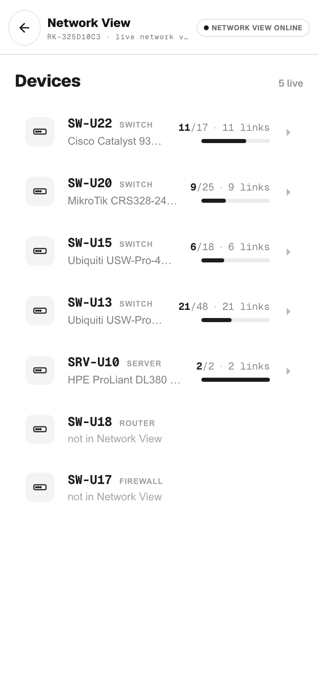
*Devices the live network recognises. Two here are “not in Network View”.*

### 24. Find out what changed, and when
*Needs a monitored switch*

RackTrack signs in to a monitored switch **once a minute** and records every port. **Drift** is the record of what changed — the gap between how the rack was left and how it is now.

1. Open **Drift**. The switch appears at the top, marked **Streaming**.
2. Click the port you care about in the grid.
3. Open the **History** tab and read the change log — it is in plain English.
4. Open the **Timeline** tab and widen the **Window** to a day or a week. This is how you tell a one-off outage from a port that has been flapping for a fortnight.
5. Tap **Poll now** to check the switch immediately instead of waiting for the next minute.

| Change | What it usually means |
|---|---|
| **Link went down / came up** | Something was plugged in, unplugged, or failed. |
| **Port administratively disabled** | A person, or a config push, shut the port. This was deliberate. |
| **Speed changed 1 Gbps → 100 Mbps** | Negotiation dropped — very often a damaged cable or a dying optic. |
| **LLDP neighbor changed: X → Y** | **The important one.** The cable now goes to a *different device*. Somebody re-patched it. |

> **TIP** — A silent **LLDP neighbor changed** is the classic cause of “it worked yesterday”. If a service broke overnight and nobody admits to touching anything, look here first.

> **IMPORTANT** — Must be set up on the server by an administrator, and today it works with **TP-Link** switches. Stuck on **“Waiting for first poll…”** means no switch is being monitored.

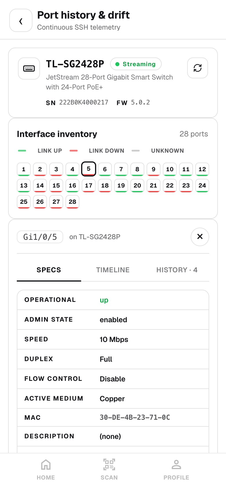
*One port opened up: its state, its timeline, its change history.*

---

## Looking things up

### 25. Look up a datasheet
*Everyone · no scan needed*

1. Open **Specifications**.
2. Type the **Make / Vendor** and the **Model**.
3. Tap **Get specifications**.

> **TIP** — Pick the vendor from the suggestions as you type rather than typing it freehand — that guarantees the name matches the one RackTrack searches under.

You get port count, throughput, PoE, power draw and form factor, with a link to the product page.

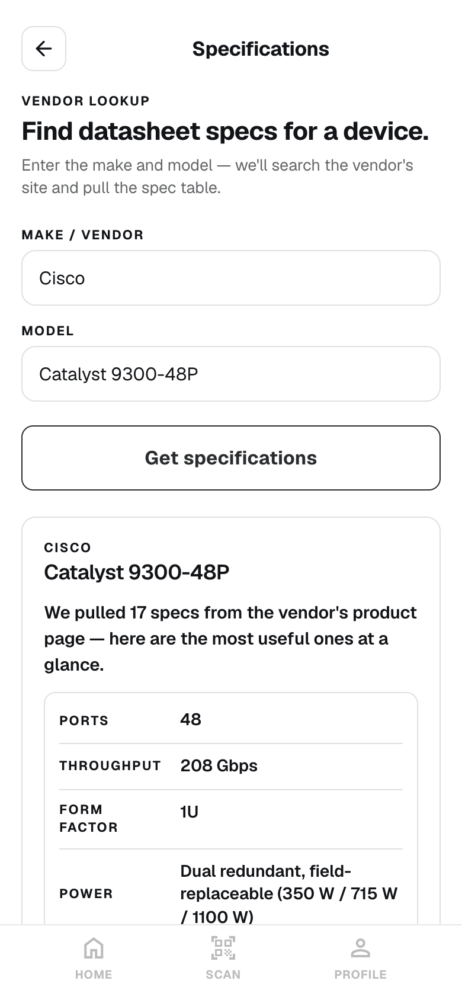
*Pulled from the vendor's own product page.*

### 26. Check any firmware version
*Everyone · no scan needed*

1. Open **Firmware Check**.
2. Type the make, the model, and the version you are running.
3. Tap **Check firmware**.

You get one plain sentence as the answer — **“You're up to date.”**, **“An upgrade is available.”**, or **“Upgrade strongly recommended.”** — with the CVE list and release notes behind **Show details**.

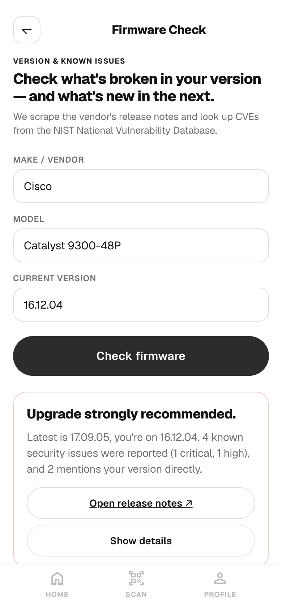
*The headline is the answer; the detail sits behind **Show details**.*

---

## Your account

### 27. Reopen a scan you did earlier
*Everyone*

**Profile** holds your account details and, the reason you will actually open it, **Recent Scans**.

1. Open **Profile**.
2. Scroll to **Recent Scans**. Every rack you have scanned is here, newest first, with its ID, how many devices and units it found, and how long ago.
3. Tap any one to reopen the full result exactly as it was. **Show all** reveals older ones.

> **TIP** — This is the way back to a rack you scanned last week — the rack links in the navigation only remember your **current** rack, and are cleared when you start a new scan.

> **NOTE** — Members see their own scans. Administrators see every scan in the organization.

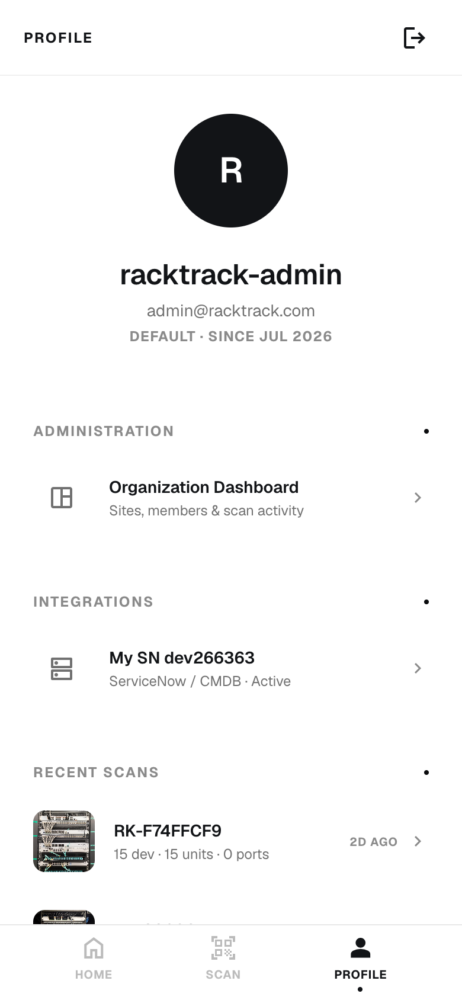
*Recent Scans — newest first.*

---

## For administrators

### 28. Connect your CMDB
*Administrators only*

Tell RackTrack where your equipment records live, so it can compare what it sees in a rack against what you believe is in that rack.

1. Go to **Profile → Integrations**, or open **Connections**.
2. Tap **+ Add connection**.
3. Give it a **Name**, choose the **Type**, and fill in the credentials.
4. Tap **Save & use**.

| System | What you need |
|---|---|
| **ServiceNow / CMDB** | Your instance ID (the part before `.service-now.com`), a username, a password. |
| **NetBox** | The base URL, and an API token from your NetBox profile. |
| **SolarWinds Orion** | The host, a username, a password. |
| **CA / DX Spectrum** | The base URL, a username, a password. |
| **Your own SQL database** | A PostgreSQL or MySQL connection string. |
| **Your own REST API** | A base URL, and a token if it needs one. |

> **NOTE** — There is **no “Test connection” button — saving is the test.** Watch the message that follows. If the credentials are wrong, that is where it tells you.

> **IMPORTANT** — **Only one connection is active at a time**, and every screen reads from that one. Switching it switches the source of *all* your data. RackTrack does not merge two systems.

> **NOTE** — Credentials are stored encrypted and **never shown again**. Editing opens the boxes **empty** — leave them empty to keep what is saved.

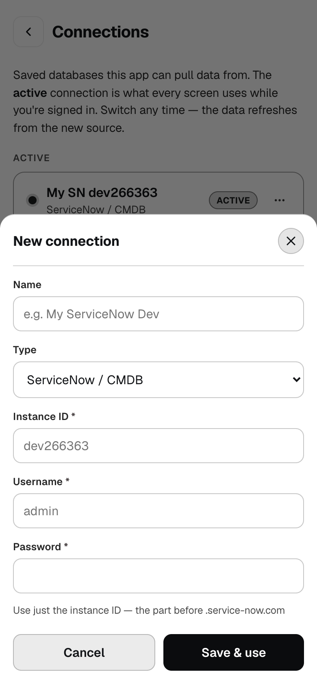
*The fields change to match the system you pick.*

### 29. Add people to your team
*Administrators only*

An **Organization** (your company) contains **Sites** (your buildings), and each site contains **Members**.

1. Open the console, find the Site row, and tap **Invite**.
2. Enter their email and pick their **Role** (`Member` or `Site Manager`).
3. Tap **Create invite link**, then **Copy**.
4. **Send them the link yourself** — by email or chat.

| Method | How it works | Use it when |
|---|---|---|
| **Invite** | RackTrack generates a link. They set their own username and password. | The normal case. Nobody shares a password. |
| **+ Add member** | You set their username and password yourself and hand them over. | A shared or contractor account, or someone with no reachable email. |

> **IMPORTANT** — **RackTrack does not send the invitation.** If you do not copy the link and send it, nothing reaches them. It works **once** and expires after **seven days**.

> **NOTE** — Click any person to filter the scans grid to just their work. Click a site to filter to that site.

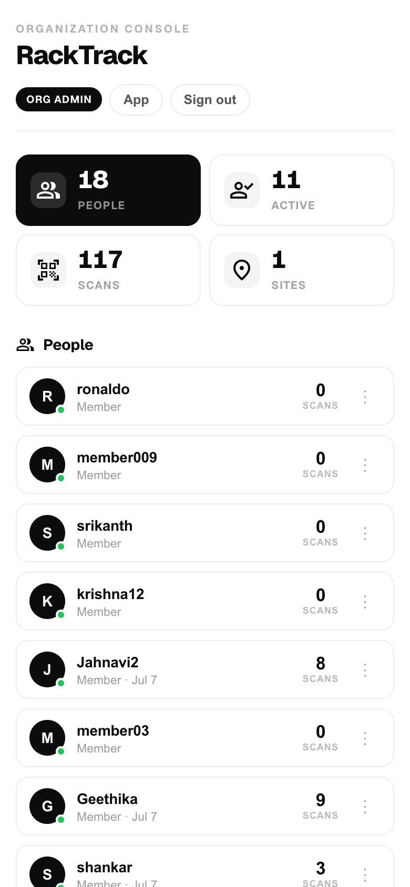
*People, sites and scans in one console.*

### 30. Approve a new organization
*Platform owner only*

When a company signs up, it appears under **Pending approvals** and **cannot use the app until you act**.

| Button | What happens |
|---|---|
| **Approve** | They get in immediately — their waiting screen lets them through by itself. |
| **Reject** | They are told the request was not approved. Their account survives. |
| **Remove** | The organization and all its people, sites and invitations are **deleted permanently**. |

> **IMPORTANT** — **Remove** **cannot be undone.** **Reject** is the reversible choice — use it unless you are certain.

> **NOTE** — **Nobody emails you about a pending signup.** You only find out by opening this console, so check it.

### 31. Sell surplus gear
*Administrators only*

1. Open **Marketplace** and tap **+ Sell something**.
2. Type the **Vendor** and **Model** — the title fills itself in.
3. Choose a **Category** and **Condition**.
4. Set a **Price**, or leave it blank so buyers see *Make an offer*.
5. Upload a photo (JPG, PNG or WebP, up to 8 MB) and wait for **Photo ready**.
6. Tap **Publish listing**.

> **NOTE** — There is no checkout and no messaging in RackTrack. A buyer contacts you through your username, and you agree price and shipping between yourselves.

> **TIP** — Use **Post a want** for equipment you are **looking for** — colleagues with decommissioned kit can then find you.

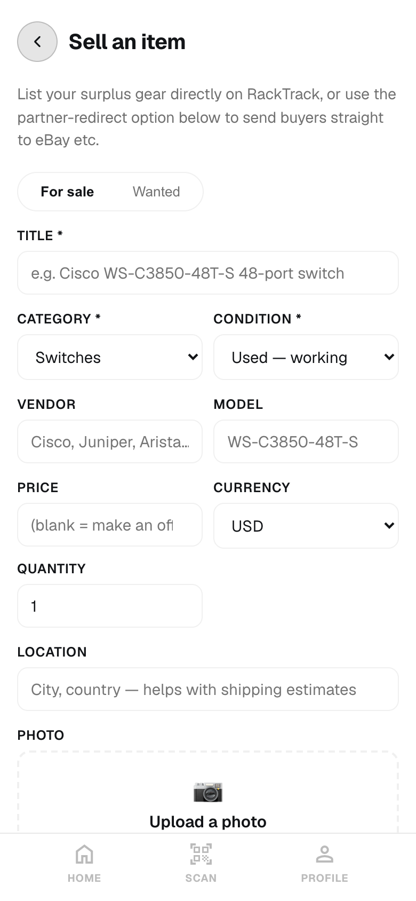
*Creating a listing.*

---

## Reference

### Where each screen gets its data

Some screens read your photo, some read the live network, and one is a demonstration with invented data. Knowing which is which saves you from acting on the wrong thing.

| Screen | Source | Needs setting up? |
|---|---|---|
| Scan · Overview · Find a port | **Your photo**, analysed by RackTrack. | No |
| Topology · 3D views | **Your photo** — the devices and cables it found. | No |
| Switches · Firmware · Specifications | **Your photo** for the model, then the vendor's public site and the US National Vulnerability Database. | No |
| Ports (live switch) | **The switch itself**, over SSH, right now. | Yes — switch credentials |
| Drift / Port history | **The switch itself**, polled once a minute. | Yes — a monitored switch (TP-Link) |
| Network view | **Netdisco**, your network discovery server. | Yes — a Netdisco server |
| CMDB registration | **Your configuration database**. | Yes — a connected CMDB |
| Marketplace | RackTrack's own records. Real listings. | No |
| `/demo/topology` | **A demonstration.** The racks, devices and IPs on that page are **invented** to show what an estate-wide view looks like. | No — but it is not your data |

### Troubleshooting — find your symptom

#### Getting in

| Symptom | Cause | Fix |
|---|---|---|
| Stuck on **Waiting for approval** | Your organization is not approved. | Tell the platform owner directly — they are not emailed. |
| You see `rate_limited` | Too many attempts in a minute. | Wait 60 seconds. |
| “This account has been deactivated.” | An administrator switched you off. | Contact your administrator. |
| The six-digit code does not work | It expired — codes last **one minute**. | Tap **Resend** and use the new one at once. |
| Your invitation link fails | It has been used, or is over seven days old. | Ask for a fresh invitation. |

#### Scanning

| Symptom | Cause | Fix |
|---|---|---|
| Tapping **SCAN** does not take the photo | The three quality checks have not all passed. | Read the hint under the guide box and fix the one thing it names. |
| No shutter button on a big screen | The shutter is the phone's bottom **SCAN** tab, which does not exist there. | Use **Upload** on an iPad or computer. |
| Devices missing from the result | Photographed at an angle, or cables hide them. | Retake square-on; add side photos. |
| The rack came back empty | A bad photo pushed through with **Proceed anyway**. | Rescan properly. |
| Progress sits at 88% | Normal — the bar is an estimate. | Wait. |

#### The live switch screens

| Symptom | Cause | Fix |
|---|---|---|
| “The switch didn't respond” | You are not on the same network as the switch. | Get off guest Wi-Fi and onto the right network. |
| “Lost the SSH session” | Most switches allow one session at a time and someone else has it. | Tap **Retry** in a moment. |
| Network view never loads | No Netdisco server is configured. | Ask an administrator. It will never load without one. |
| Drift says “Waiting for first poll…” forever | No switch is being monitored. | Ask an administrator to set one up. |
| A free-looking port says **Reserved** | It has a description, so somebody has claimed it. | Check with the switch's owner. |

#### Data that looks wrong

| Symptom | Cause | Fix |
|---|---|---|
| A switch shows **Not detected** | The label was unreadable in the photo. | Type the make and model in yourself. |
| “Latest version unknown” | RackTrack could not confirm the newest version. **This is not “you are current”.** | Follow **Check site ↗** and check the vendor. |
| A cable seems to skip a patch panel | Passive panels are invisible to the switch. Physics, not a bug. | Nothing to fix. |
| The make/model you typed vanished | It was saved in that browser only. | Re-enter it. It does not travel between devices. |

### Glossary

| Term | Plain meaning |
|---|---|
| **U / rack unit** | The standard height slot in a rack. A 42U rack has 42 slots. |
| **CMDB** | Your official record of what equipment you own and where it is. |
| **Drift** | The gap between what your records say and what is actually there — or what changed on a port since last time. |
| **LLDP** | How a device announces itself to its neighbours. It is how RackTrack knows what is on the far end of a cable. |
| **MAC address** | The unique hardware address of a network card. Seeing one on a port means something is alive there. |
| **SFP / SFP+ / QSFP** | Slots that take a plug-in transceiver, usually for fibre. SFP+ is 10G; QSFP is faster. |
| **DAC** | Direct-attach cable — transceivers built into both ends. Cheaper than optics for short runs. |
| **CVE** | A publicly catalogued security vulnerability, with a severity score. |
| **PoE** | The switch powering a device through the same cable that carries its data. |
| **VLAN** | A logical network. Two devices on one switch but different VLANs cannot talk directly. |
| **Uplink** | The port carrying traffic out of this switch to the rest of the network. |

### Limits and timings

| Thing | Limit |
|---|---|
| Photo or video upload size | 340 MB per file |
| Photos in a **MULTI** stitch | 2 to 8 |
| Video length | 1 to 120 seconds |
| Scans per minute | 20 |
| Sign-up and password-reset codes | Expire after **1 minute** |
| Invitation links | Single use · expire after **7 days** |
| How long you stay signed in | 30 days |
| How often drift polls the switch | Once a minute |
| Manual **Poll now** presses | 5 per minute |
| Marketplace photo | JPG, PNG or WebP · up to 8 MB |

